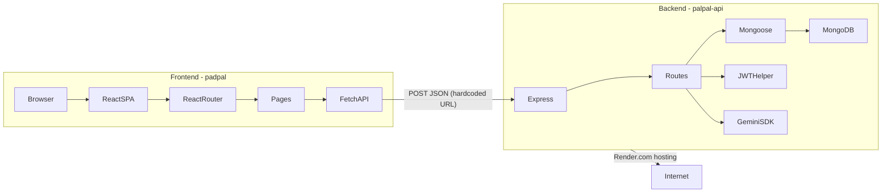

# PadPal — Product Requirements Document

**Version 2.0 | June 8, 2026**  
**Repositories:** `padpal` (frontend) · `palpal-api` (backend)  
**Design spec:** `docs/product/specs/2026-06-08-vacancy-listings-design.md`

---

## Table of Contents

1. [Product Overview](#1-product-overview)
2. [Core Value Proposition](#2-core-value-proposition)
3. [Target Users](#3-target-users)
4. [Feature Breakdown](#4-feature-breakdown)
5. [User Flows](#5-user-flows)
6. [Technical Architecture Overview](#6-technical-architecture-overview)
7. [Frontend Architecture Summary](#7-frontend-architecture-summary)
8. [Backend Architecture Summary](#8-backend-architecture-summary)
9. [API / System Interaction Overview](#9-api--system-interaction-overview)
10. [Current Strengths](#10-current-strengths)
11. [Critical Bugs](#11-critical-bugs)
12. [Security Concerns](#12-security-concerns)
13. [Scalability Concerns](#13-scalability-concerns)
14. [UX Concerns](#14-ux-concerns)
15. [Missing Functionality](#15-missing-functionality)
16. [Recommendations for Production Readiness](#16-recommendations-for-production-readiness)
17. [Future Feature Opportunities](#17-future-feature-opportunities)
18. [Data Model Reference](#18-data-model-reference)
19. [Competitive Analysis](#19-competitive-analysis)

---

## 1. Product Overview

PadPal is a mobile-first web application for roommate discovery and pairing. Modeled after swipe-based dating apps (Hinge/Tinder), it serves **three distinct matching intents** via separate feeds:

1. **Home (User ↔ User)** — Find one compatible roommate and search for housing together.
2. **Rooms — Listing → User** — Households with a vacancy create a listing, invite current tenants, and swipe on individuals open to filling an existing room.
3. **Rooms — User → Listing** — Individuals looking to join an existing home swipe on vacancy listings ranked by compatibility.

All feeds share ranked compatibility scoring, swipe-card UX, mutual-match gating, and in-app chat. An AI chatbot (powered by Google Gemini) is always present as an introductory conversation partner. **Match means permission to start a conversation — not a lease commitment.**

---

## 2. Core Value Proposition

Traditional roommate search is unstructured and unsafe. PadPal solves this by:

- Separating **intent** into dedicated feeds (find a roommate + apartment vs. fill a vacancy vs. join an existing home) so users never see irrelevant recommendations
- Collecting core matching data at signup (age, city, budget, gender prefs, `@username`) with optional lifestyle enrichment in Settings to reduce onboarding burnout
- Running a server-side compatibility scoring algorithm that ranks candidates and listings before surfacing them
- Presenting familiar swipe-card UI that hard-filters incompatible fits before the user sees them
- Providing match-gated chat (1:1 or household group chat) that only opens on mutual interest — reducing unsolicited contact
- Supporting **household vacancy listings** with co-tenant invites, equal admin rights, and privacy-preserving location display (neighborhood only)

---

## 3. Target Users

- College students and young adults (18–30) searching for first or next-year housing
- Urban renters looking for roommates in specific cities
- People relocating who need both housing and a compatible living partner
- **Households with one open room** replacing a departing roommate (3-bed/2-bath with one vacancy)
- **Individuals open to joining an existing home** rather than signing a new lease with one stranger
- Users who want structured lifestyle compatibility screening rather than open classifieds

---

## 4. Feature Breakdown

### 4.1 Authentication

- **Register:** Email + password, returns JWT access token and user `_id`. Password hashed at database layer via bcrypt pre-save hook.
- **Login:** Email + password, returns JWT + `gender` flag. Presence of `gender` determines if onboarding is complete.
- **Session persistence:** Access token stored in a cookie named `isLoggedIn`; user `_id` stored in a separate `id` cookie, both via `js-cookie`.
- **Logout:** Clears both cookies, redirects to `/`.
- **Token refresh:** Refresh token endpoint exists on the backend (`POST /auth/refreshToken`) but is not called by the frontend.

### 4.2 Onboarding / Profile Setup

Onboarding is a **short required core** followed by optional enrichment in Settings (beta).

**Required at signup** (gates feed access):

- Gender and gender preferences
- Age and acceptable roommate age range
- City and monthly budget range
- `@username` (unique handle for roommate invites)
- Phone number (for SMS listing invites)
- Terms & Conditions acceptance (link on sign-up page)

**Optional in Settings** (improves soft scoring and compatibility badges):

- Lease type preferences and move-in/move-out timing
- Cleanliness, pet, smoking, and guest preferences
- Bio, profile photos, hobbies
- Identity verification (webcam + ID via `face-api.js`)

Legacy `/survey` route may still host multi-step UI; data submits via `POST /auth/survey` and images via `POST /images/addImages`. A `needsOnboarding` cookie triggers a brief swipe tutorial on first Home feed visit.

### 4.3 Compatibility Feed (Swiping)

- Feed loads from `POST /feed/` with the current user's `_id`
- Backend filters candidates by: gender preference, city, move-out date in the future, and excludes already-swiped users
- Candidates are scored and returned sorted by score descending
- Frontend renders a stack of `UserCard` components driven by Framer Motion drag gestures
- Swipe right (or `ArrowRight` keyboard) = interested; swipe left = pass
- Both directions trigger `POST /match/saveMatch`
- After a swipe, `POST /match/getMatch` checks for a mutual match and triggers a confetti/celebration overlay if both users liked each other
- Cards expose: name, age, city, budget, move-out date, lease type, cleanliness/pet/guest/smoker preferences, bio, hobbies, and a photo carousel

### 4.4 Matching System (Backend Scoring)

All logic lives in `palpal-api/routes/feed.js`. Hard filters are applied first, then point scoring ranks the remaining candidates.

**Hard filters (candidate excluded if any fail):**

- `gender` matches current user's `genderPreferences`
- `city` matches current user's `city`
- `expectedMoveOut` is in the future
- Not the current user
- Not already swiped on

**Soft score (summed, sorted descending):**

| Criterion                                           | Points         |
| --------------------------------------------------- | -------------- |
| Candidate age within user's `agePreferences` range  | 5              |
| Budget max within $200 of current user's budget max | 5              |
| Expected move-out in same calendar month            | 5              |
| Overlapping lease type preferences                  | 5 each overlap |
| Cleanliness level match                             | 3              |
| Guest preference match                              | 3              |
| Pet preference match                                | 3              |
| Smoker preference match                             | 3              |
| Each shared hobby                                   | 1 per hobby    |

### 4.5 Profile View & Edit

- **View profile** (`/viewProfile?id=...`): Loads a single user via `POST /feed/getUser`, renders in a read-only `UserCard`.
- **Edit profile** (`/editProfile`): Loads current user's data, allows editing all onboarding fields. Submits via `POST /auth/survey` (same endpoint as initial onboarding). Image management via `deleteImages` then `addImages`.

### 4.6 Chat & Messaging

- **Chat list** (`/chat`): Loads all mutual matches via `POST /chat/getChats`, polled every 3 seconds. The AI bot (`673eed0fd24e7b1c05d6616e`) is always appended to every user's chat list.
- **Chat room:** Renders messages grouped by date. Supports optimistic appending of outgoing messages. Sends via `POST /chat/sendMessage`.
- **AI chat:** When the conversation partner is the hardcoded bot ID, messages are routed to `POST /chat/chatAI`, which calls Google Gemini (`gemini-1.5-flash`) and saves the response.
- **Unmatch:** Available from the chat room settings modal via `POST /match/unmatch`.

### 4.7 Navigation

- Persistent `NavBar` visible on all routes except `/` and onboarding
- NavBar links: **Home** (user↔user feed), **Rooms** (vacancy feeds), Chat, Profile, Logout
- Routes: `/` (sign in/register), `/survey` or onboarding, `/feed` (Home), `/rooms`, `/chat`, `/viewProfile`, `/editProfile`, `/settings`

**Rooms tab behavior:**

- First visit: entry screen — "I have a vacancy in my home" vs "I want to fill a vacancy"
- After setup: routes directly to active feed (`Listing → User` or `User → Listing`)
- Mode switch via Settings with confirmation (archive/transfer rules apply)
- Home feed always available independently of Rooms mode

### 4.8 Vacancy Listings (Rooms Feed)

See `docs/product/specs/2026-06-08-vacancy-listings-design.md` for full spec.

**Listing creation wizard** (draft-save at every step):

1. Home basics — private full address (dedup), bed/bath, public neighborhood, rent, move-in, lease
2. Photos + "About the Home"
3. Ideal candidate preferences
4. Co-tenant invites (`@username`, SMS preferred, email fallback)
5. Review

**Go-live gate:** all required fields + creator + ≥1 accepted co-tenant. Pending invitees show as "Pending" on card.

**Listing states:** `DRAFT` → `LIVE` → `ARCHIVED` (manual "Vacancy filled", 2–3 weeks inactivity, or mode switch). Instant reactivation on login (Depop-style popup).

**Dedup:** one live listing per normalized address; duplicate → join prompt; new listing only after archive.

**Swipe rules (beta):**

- Per-tenant pass (silent; removes from that tenant's feed only)
- Match when any accepted tenant swipes right AND seeker swipes right on listing
- Auto group chat with seeker + all accepted tenants
- Household-wide unmatch (confirmation required)
- Unlimited concurrent listing matches until vacancy filled

**Compatibility badge:** top 3–4 traits shared between seeker and the most tenants; copy: "You and one or more roommates like: …"

**Privacy:** neighborhood + city on card; full address never shown in-app (shared in chat manually).

### 4.9 Safety & Moderation (Beta)

- Report and block users and listings
- Automated image moderation on upload (Google Cloud Vision SafeSearch or AWS Rekognition) for profile and home photos
- Terms & Conditions at signup (fair-housing language in legal draft)

---

## 5. User Flows

```mermaid
flowchart TD
    A[Land on /] --> B{Has account?}
    B -->|No| C[Register]
    B -->|Yes| D[Login]
    C --> E{Gender set?}
    D --> E
    E -->|No| F["/survey — 16-step onboarding"]
    E -->|Yes| G[/feed]
    F --> G
    G --> H[Onboarding tutorial modal]
    H --> I[Browse swipe cards]
    I --> J{Swipe direction}
    J -->|Left / Pass| I
    J -->|Right / Like| K["POST saveMatch"]
    K --> L{Mutual match?}
    L -->|Yes| M[Confetti overlay + Match banner]
    L -->|No| I
    M --> N[/chat]
    N --> O[Chat room with match]
    O --> P{Is bot?}
    P -->|Yes| Q["chatAI — Gemini response"]
    P -->|No| R[sendMessage]
```

---

## 6. Technical Architecture Overview



---

## 7. Frontend Architecture Summary

- **Framework:** React 18, `react-scripts` 5 (CRA) with a parallel Webpack 5 pipeline
- **Routing:** React Router DOM v6, `BrowserRouter`, route-level components in `src/pages/`
- **State:** No global state library; per-page `useState`/`useRef`; backend is source of truth
- **Auth:** `js-cookie` — access token in `isLoggedIn` cookie, user ID in `id` cookie
- **API:** Plain `fetch`, no shared client module, no interceptors, all base URLs hardcoded to `https://palpal-api.onrender.com`
- **UI:** MUI Material + MUI Joy + Bootstrap + custom per-component CSS + Tailwind (configured but not primary)
- **Animation:** Framer Motion (card drag, page transitions), Lordicon JSON players, tsParticles (confetti)
- **Key dependencies:** `js-cookie`, `dayjs`, `face-api.js`, `react-webcam`, `framer-motion`
- **Unused/dead code:** `@nextui-org/react`, `openai` in `package.json` with no imports; `HashRouter` imported but not used in `App.js`; large base64 image blob exported from `chatRoom/index.jsx`

**`src/` structure:**

```
src/
  pages/
    signIn/       — Login + register
    survey/       — 16-step onboarding questionnaire
    feed/         — Swipe feed + UserCard
    chat/         — Chat list + room + settings
    viewProfile/  — Read-only profile view
    editProfile/  — Editable profile
  components/
    navBar/       — Global chrome
```

---

## 8. Backend Architecture Summary

- **Framework:** Express 4, CommonJS modules
- **Database:** MongoDB via Mongoose 8
- **Auth:** `jsonwebtoken` — tokens signed but middleware **never applied to any route**
- **Password security:** `bcrypt-nodejs` (deprecated package)
- **Validation:** `@hapi/joi` schema defined but **never applied**
- **AI:** `@google/generative-ai` (Gemini 1.5 Flash)
- **Entry point:** `app.js` (note: `package.json` `main` points to nonexistent `index.js`)
- **Deployment:** Hosted on Render.com; `netlify.toml` present but incomplete

**`palpal-api/` structure:**

```
palpal-api/
  app.js            — Express entry, middleware, route mounting
  routes/
    auth.js         — Register, login, survey, refresh, logout
    feed.js         — Compatibility scoring, profile load
    match.js        — Save/get/unmatch
    chat.js         — Get chats, send, AI
    image.js        — Add/delete images
  models/
    userModels.js
    matchModels.js
    chatModels.js
    imageModels.js
  helpers/
    jwtHelper.js        — Sign/verify access and refresh tokens
    validationSchema.js — Joi schema (unused)
    initMongoDb.js      — Mongoose connect
    keyGenerator.js
```

---

## 9. API / System Interaction Overview

All frontend-to-backend communication is via `POST` with JSON bodies. No REST conventions are followed (`GET`, `PATCH`, `DELETE` are unused outside the broken logout). The frontend passes the user's MongoDB `_id` in request bodies for identification — no `Authorization` headers are sent.

| Frontend call site          | Endpoint                    | Key body params                   |
| --------------------------- | --------------------------- | --------------------------------- |
| `signIn/index.jsx`          | `POST /auth/login`          | `email`, `password`               |
| `signIn/index.jsx`          | `POST /auth/register`       | `email`, `password`               |
| `survey/index.jsx`          | `POST /auth/survey`         | all survey fields + `_id`         |
| `survey/index.jsx`          | `POST /images/addImages`    | `owner`, `images[]`               |
| `feed/index.jsx`            | `POST /feed/`               | `id`                              |
| `feed/index.jsx`            | `POST /feed/getUser`        | `id`                              |
| `feed/components/UserCard`  | `POST /match/saveMatch`     | `from`, `to`, `isAMatch`          |
| `feed/components/UserCard`  | `POST /match/getMatch`      | `from`, `to`                      |
| `chat/index.jsx`            | `POST /chat/getChats`       | `id`                              |
| `chat/components/chatRoom`  | `POST /chat/sendMessage`    | `from`, `to`, `message`, `date`   |
| `chat/components/chatRoom`  | `POST /chat/chatAI`         | `message`, `from`, `to`           |
| `chat/components/settings`  | `POST /match/unmatch`       | `from`, `to`                      |
| `editProfile/index.jsx`     | `POST /auth/survey`         | all profile fields + `_id`        |
| `editProfile/index.jsx`     | `POST /images/deleteImages` | `userId`                          |
| `editProfile/index.jsx`     | `POST /images/addImages`    | `owner`, `images[]`               |
| `rooms/*` (planned)         | `POST /listings/create`     | listing fields                    |
| `rooms/*` (planned)         | `POST /listings/feed`       | seeker feed (ranked listings)     |
| `rooms/*` (planned)         | `POST /listings/candidates` | creator feed (ranked seekers)     |
| `rooms/*` (planned)         | `POST /listings/invite`     | phone, email, or username         |
| `rooms/*` (planned)         | `POST /match/saveListingSwipe` | listingId, direction           |
| `rooms/*` (planned)         | `POST /chat/sendGroupMessage` | matchId, message               |

---

## 10. Current Strengths

- **Coherent end-to-end product:** Auth → onboarding → feed → match → chat is fully wired and functional as a prototype
- **Rich onboarding data model:** 14+ lifestyle dimensions collected, giving real signal for compatibility
- **Scoring system is extensible:** Point-based model in `feed.js` is easy to tune weights or add new dimensions
- **Framer Motion drag UX:** Native-feeling swipe with keyboard fallback is a solid UX foundation
- **AI chat integration:** Gemini endpoint creates an always-available onboarding conversation partner
- **Client-side facial verification:** `face-api.js` prototype shows awareness of identity/safety concerns
- **Image management pipeline:** Upload and replacement via add/delete pattern works end-to-end

---

## 11. Critical Bugs

### Backend

- **`verifyAccessToken` middleware is imported in `app.js` but never attached to any router** — every endpoint is completely unauthenticated and can be called by anyone with knowledge of the API shape
- **`POST /auth/register` calls `signAccessToken` twice** instead of calling `signRefreshToken` for the second token — no refresh token is ever issued
- **`POST /auth/survey` does a blind `$set: req.body`** — any field including `password` can be overwritten by a client sending arbitrary keys (mass-assignment vulnerability)
- **`expectedMoveOut` is declared as `Date` in the schema but accessed as `currUser.expectedMoveOut[0]`** in `feed.js` — move-out scoring is partially broken for this field
- **`smokerPreferences`** key appears twice in `userModels.js` — second definition silently overwrites the first in JavaScript
- **`DELETE /auth/logout` references `error` instead of `err`** in the catch block — `ReferenceError` at runtime if the try block throws
- **`bcrypt-nodejs` pre-save hook** references an undefined `error` variable on hash failure — unhandled exception path

### Frontend

- **`setTimeout` runs in the `signIn` component body** (not inside `useEffect`) — fires on every re-render, creating unbounded timeouts
- **`editProfile/index.jsx` reads `agePreferences.current` and `budget.current`** on submit, but these are `useState` values, not refs — these fields are always `undefined` in the update payload
- **`viewProfile/index.jsx` passes a single user object as `users`** to `UserCard`, which expects an email-keyed map — `isKeyLast` and related logic behave incorrectly
- **Duplicate `id: 19`** in `survey/questions.js` (hobbies and facial verification share the same ID) — broken React keys and analytics
- **A large base64 image string is exported from `chatRoom/index.jsx`** after the component — bloats the JS bundle

---

## 12. Security Concerns

- **All API routes are publicly accessible** — no authentication enforced server-side
- **`POST /auth/survey` accepts arbitrary field overwrites** including `password` — mass-assignment vulnerability
- **JWT stored in a non-HttpOnly cookie** — accessible to JavaScript, XSS risk
- **User identity passed as `id` in request body** — trivial to impersonate any user without server-side JWT verification
- **`.gitignore` only ignores `node_modules`** — `.env` file containing secrets (`MONGODB_URI`, `ACCESS_TOKEN_SECRET`, `API_KEY`) is likely committed to the repository
- **`express.json({ limit: "50mb" })`** — enables denial-of-service via oversized request payloads

---

## 13. Scalability Concerns

- **N+1 query pattern in `POST /feed/`:** For each candidate user, separate `Match.find` and `Image.find` queries are issued — will degrade severely as user count grows
- **No DB indexes declared** on hot query paths: `matches` collection on `(from, to, isAMatch)`, `chats` collection on `(from, to, date)`, `images` on `owner`
- **Chat polling every 3 seconds** from every client without backoff or Page Visibility detection — multiplies server load linearly with active users
- **No message pagination** — `getChats` loads the entire message history for every chat on every poll
- **Images stored as base64 strings in MongoDB** — instead of object storage (S3/Cloudflare R2), causing large document sizes and slow reads
- **No caching layer** — feed scoring reruns the full candidate loop on every request; no Redis or in-memory cache
- **Single Express process** with no horizontal scaling strategy — Render.com free tier sleeps on inactivity

---

## 14. UX Concerns

- **No loading states** on several API calls — UI freezes with no feedback while awaiting server responses
- **No error UI** — most errors are `console.log` only; users see nothing on failure
- **Chat is not real-time** — 3-second polling introduces visible delay; no typing indicators
- **Feed card stacking is limited** — no infinite scroll or pre-fetch; once the rendered candidates are exhausted, no clear empty state is shown
- **No "no more matches" state** surfaced to the user when the feed is empty
- **Onboarding is all-or-nothing** — no partial save/resume; if the user closes mid-survey, all progress is lost
- **Profile photos are base64-encoded inline** — large payloads slow page load on the feed
- **`manifest.json` and `index.html` still contain CRA defaults** — "React App" title and metadata
- **Mobile layout** relies on CSS breakpoints without a native app wrapper (Capacitor/Expo not used) — Framer Motion drag behaviors may differ on touch vs mouse

---

## 15. Missing Functionality

- **Server-side authentication enforcement** — no route requires a valid JWT
- **Photo moderation** — no content filtering on uploaded images
- **Push notifications** — no mechanism to alert users of new matches or messages
- **Block/report user** — planned for beta (see §4.9); not yet implemented
- **Profile completeness indicator** — no feedback on what's missing from a profile
- **Location-based search** — city is a hard filter; no radius/proximity search
- **Seen/read receipts** in chat
- **Message delivery status** (sent/delivered/read)
- **Account deletion / data export**
- **Email verification** on registration
- **Password reset flow**
- **Terms of Service / Privacy Policy** — link at signup planned; full legal pages in progress
- **Accessibility (a11y)** — no ARIA labels observed, no keyboard trap management in modals
- **`/auth/onboarded` endpoint call** — commented out in the frontend onboarding component; backend behavior is never triggered

---

## 16. Recommendations for Production Readiness

### Immediate (Blockers)

- Enforce `verifyAccessToken` middleware on all routes except `/auth/login` and `/auth/register`
- Fix `POST /auth/survey` to use an allowlist of updatable fields instead of blind `$set: req.body`
- Store tokens in `HttpOnly; Secure; SameSite=Strict` cookies or move to `Authorization` header pattern
- Fix register endpoint to issue a real refresh token (currently calls `signAccessToken` twice)
- Add `.env` to `.gitignore` and rotate all secrets immediately
- Fix `signIn` `setTimeout` to run inside `useEffect`
- Fix `editProfile` to use state values (not `.current`) in the update payload
- Fix `expectedMoveOut` to be stored and read consistently as an array or scalar across schema and routes

### Short-Term (Production Quality)

- Add DB indexes: `matches(from, to, isAMatch)`, `chats(from, to, date)`, `images(owner)`
- Move image storage to an object storage service (S3, Cloudflare R2); store only URLs in MongoDB
- Reduce JSON payload limit from `50mb` to `~5mb`
- Implement exponential backoff + Page Visibility API in chat polling
- Add message pagination to `getChats`
- Create a centralized API client module on the frontend with base URL from an environment variable
- Fix N+1 in feed with MongoDB `$lookup` aggregation
- Add `try/catch` wrappers to all async Express route handlers
- Apply Joi validation schema to register and login routes
- Fix duplicate question `id: 19` in `survey/questions.js`
- Remove dead base64 artifact from `chatRoom/index.jsx`
- Remove unused dependencies: `openai`, `redis-commander` (backend); `@nextui-org/react` (frontend)
- Add empty and error states to Feed, Chat, and EditProfile
- Replace CRA default metadata in `manifest.json` and `index.html`

### Medium-Term (Scale & Quality)

- Replace polling with WebSockets (Socket.io) for real-time chat
- Add Redis caching for feed results (TTL-based invalidation on swipe)
- Add email verification on registration
- Add password reset flow
- Implement account deletion with full data purge
- Add structured logging (Winston/Pino) and error tracking (Sentry)
- Implement rate limiting (`express-rate-limit`) on auth routes
- Add an image moderation pass (AWS Rekognition / Google Vision)

---

## 17. Future Feature Opportunities

- **Native mobile app** via React Native or Capacitor wrapping this web app
- **AI-powered bio suggestions** — use Gemini to help users write their bio during onboarding
- **Video introductions** — 30-second video profile option alongside photos
- **Lease document sharing** — allow matched users to share and review lease documents in-app
- **Neighborhood explorer** — map view of listings near matched users' city selections
- **Mutual friends / social graph** — optional social sign-in to surface LinkedIn/Instagram mutual connections
- **Background check integration** — opt-in identity and background screening for trust-building
- **Smart notifications** — ML-based optimal send-time for match/message alerts
- **Household-wide pass veto** — optional setting for listings with 3+ tenants (per-tenant pass in beta)
- **Landlord mode** — allow property managers to list units and receive applications from matched pairs
- **Premium tier** — unlimited swipes, see who liked you, priority in feed scoring

---

## 18. Data Model Reference

### User

| Field                    | Type              | Notes                                          |
| ------------------------ | ----------------- | ---------------------------------------------- |
| `email`                  | String (unique)   | Lowercase, required                            |
| `password`               | String            | Bcrypt-hashed via pre-save hook                |
| `name`                   | String            |                                                |
| `age`                    | Date              | Stored as birth date; age computed at runtime  |
| `gender`                 | String            | Used as hard filter in feed                    |
| `genderPreferences`      | [String]          | Candidate's gender must be in this array       |
| `agePreferences`         | [{ min, max }]    | Acceptable roommate age range                  |
| `city`                   | [String]          | Hard filter; must match candidate city         |
| `budget`                 | [{ min, max }]    | Monthly budget range                           |
| `leaseType`              | [String]          | e.g. month-to-month, 6-month, 12-month         |
| `expectedMoveOut`        | Date              | Schema type; accessed as array in feed (bug)   |
| `cleanlinessPreferences` | String            | Soft score factor                              |
| `petPreferences`         | String            | Soft score factor                              |
| `smokerPreferences`      | String            | Duplicate key in schema (second value wins)    |
| `guestPreferences`       | String            | Soft score factor                              |
| `hobbies`                | [String]          | Each shared hobby adds 1 point to score        |
| `bio`                    | String            | Free-text profile description                  |
| `username`               | String (unique)   | `@handle` for invites; case-insensitive        |
| `phone`                  | String            | Required for SMS listing invites               |
| `roomsMode`              | String            | `null` \| `creator` \| `seeker`                |
| `lastActiveAt`           | Date              | Inactivity archive job                         |

### Listing

| Field                 | Type              | Notes                                           |
| --------------------- | ----------------- | ----------------------------------------------- |
| `addressNormalized`   | String            | Private; dedup key                              |
| `neighborhood`        | String            | Public on card                                  |
| `city`                | String            | Hard filter                                     |
| `bed` / `bath`        | Number            | Display on card                                 |
| `rent`                | Number            | Open room rent; budget hard filter              |
| `moveInDate`          | Date              | Hard filter                                     |
| `leaseType`           | String            | Required listing field                          |
| `about`               | String            | "About the Home"                                |
| `idealCandidatePrefs` | Object            | Gender prefs, lifestyle fields                  |
| `photos`              | [String]          | Home images; moderated on upload                |
| `status`              | String            | `draft` \| `live` \| `archived`                 |
| `createdBy`           | ObjectId → User   | Initial creator                                 |
| `tenants`             | [Object]          | Accepted + pending co-tenants                     |

### ListingInvite

| Field       | Type            | Notes                              |
| ----------- | --------------- | ---------------------------------- |
| `listingId` | ObjectId        | Target listing                     |
| `inviterId` | ObjectId → User | Who sent invite                    |
| `invitee`   | String          | Phone, email, or username          |
| `status`    | String          | `pending` \| `accepted` \| `declined` |

### Match

| Field      | Type              | Notes                                          |
| ---------- | ----------------- | ---------------------------------------------- |
| `type`     | String            | `user` \| `listing`                            |
| `from`     | ObjectId → User   | The user who swiped                            |
| `to`       | ObjectId → User   | Swiped user (user matches)                     |
| `listingId`| ObjectId → Listing| Listing (listing matches)                      |
| `seekerId` | ObjectId → User   | Seeker in listing match                        |
| `triggeringTenantId` | ObjectId → User | Tenant whose right-swipe completed match |
| `isAMatch` | Boolean           | True = swiped right                            |

### Chat

| Field          | Type            | Notes                                |
| -------------- | --------------- | ------------------------------------ |
| `type`         | String          | `direct` \| `group`                  |
| `participants` | [ObjectId]      | Group chat members                   |
| `listingId`    | ObjectId        | Optional; listing group chats        |
| `matchId`      | ObjectId        | Associated match                     |
| `message`      | String          | Message content                      |
| `from`         | ObjectId → User | Sender                               |
| `to`           | ObjectId → User | Recipient (direct chats)             |
| `date`         | Date            | Used for grouping and sort           |

### Image

| Field   | Type            | Notes                                     |
| ------- | --------------- | ----------------------------------------- |
| `owner` | ObjectId → User | References the user this image belongs to |
| `image` | String          | Base64-encoded image or URL               |

---

## 19. Competitive Analysis

### Positioning

PadPal is a **people-first compatibility matcher**, not a classifieds board. It competes with free informal channels (Facebook, Craigslist) and legacy roommate apps (Roomi, Roommates.com, SpareRoom) by combining dating-app UX, ranked matching, and vacancy-specific flows.

### Feature Comparison

| Capability | Facebook Groups / Craigslist | Roomi | Roommates.com / SpareRoom | PadPal |
| --- | --- | --- | --- | --- |
| **UX paradigm** | Feed/posts, manual DM | Listings + search filters | Searchable profiles/listings | Swipe cards (Hinge-like) |
| **Compatibility ranking** | None | Basic filters only | Filters; no ranked stack | Server-side scoring + hard filters |
| **Mutual-match gating** | No — anyone can message | Partial / open contact | Open messaging common | Chat only on mutual match |
| **Fill-one-vacancy flow** | Manual posts in groups | Mixed with whole-unit listings | Listing-centric; weak household coordination | Dedicated **Rooms** feed with co-tenant invites |
| **Household coordination** | Group chat off-platform | None native | None native | Equal tenant admin, group chat on match |
| **Intent separation** | All posts in one feed | Roommates + rentals mixed | Profiles + listings mixed | Home vs Rooms feeds by intent |
| **Identity / trust** | None | Optional verification | Email/phone confirm | Optional ID verify + image moderation + report/block |
| **Location privacy** | Often full address public | Varies | Varies | Neighborhood on card; address never in-app |
| **Onboarding depth** | None | Moderate | Moderate | Required core + optional lifestyle enrichment |
| **AI assistance** | None | None | None | Gemini onboarding bot |

### Why PadPal Wins (When Density Exists)

1. **Right problem, right feed** — Filling one room in an existing lease is the most common young-renter scenario; incumbents treat it as a footnote to whole-apartment search.
2. **Familiar mechanics** — Users already know swipe → match → chat from dating apps; Roomi/Roommates.com require learning search-and-message workflows.
3. **No spam inbox** — Facebook/Craigslist expose users to unsolicited DMs; PadPal's mutual gate and household group chat reduce harassment surface.
4. **Household as first-class entity** — Co-tenant invites, equal edit rights, and group chat mirror how vacancy fills actually happen; competitors treat listings as a single poster.
5. **Compatibility before conversation** — Hard filters + soft scoring mean users spend time talking to plausible fits, not parsing 200-word Craigslist posts.
6. **Safety stack** — Image moderation, report/block, optional verification, and T&C at signup vs. unmoderated Facebook groups.

### Competitive Risks

| Risk | Mitigation |
| --- | --- |
| Free alternatives good enough | Lead with UX, matching depth, and vacancy-specific flows |
| Chicken-and-egg density | City-by-city launch; Rooms feed targets narrower high-intent pool |
| Roomi adds swiping | PadPal's moat is integrated Home + Rooms intents and household coordination |
| Users want full addresses early | Neighborhood-first builds trust; address shared in chat when ready |
